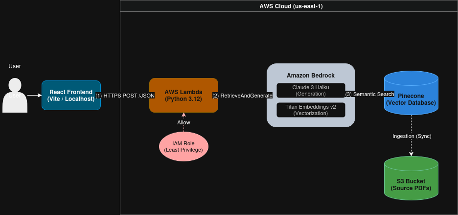

# Cloud Compass ☁️🧭
> **A Serverless RAG (Retrieval-Augmented Generation) Platform architected on AWS.**


## 📖 Project Overview
Cloud Compass is a secure, cloud-native Knowledge Assistant that allows enterprises to interact with private documentation using Generative AI. 

Unlike standard chatbots, this system leverages a **Retrieval-Augmented Generation (RAG)** pipeline to ground responses in specific source data (PDFs), eliminating hallucinations and providing accurate citations. The entire infrastructure is automated using **Terraform**, ensuring a reproducible, version-controlled environment.

### 🎯 Key Use Cases
* **Technical Support:** Reduces ticket resolution time by instantly retrieving troubleshooting steps from manuals.
* **Compliance:** Allows HR/Legal teams to query complex policy documents with citation-backed answers.

---

## 🏗️ Architecture
The system follows a **Serverless Microservices** architecture to ensure scalability and zero idle costs.



### Tech Stack
* **Frontend:** React + Vite (Single Page Application).
* **Compute:** AWS Lambda (Python 3.12) via Function URL.
* **GenAI Model:** Amazon Bedrock (Claude 3 Haiku 4.5).
* **Vector Database:** **Pinecone (Serverless)** — *Managed via Amazon Bedrock Knowledge Base.*
* **Embeddings:** Amazon Titan Embeddings v2.
* **Storage:** AWS S3 (Document Source & Terraform State).
* **IaC:** Terraform.

---

## ⚙️ Technical Implementation & Design Choices

### 1. Infrastructure as Code (Terraform)
We avoided manual console configuration by defining the entire stack in Terraform.
* **Benefit:** Enables rapid teardown/rebuild and prevents "Configuration Drift."
* **Modules:** Infrastructure is split into `compute`, `storage`, and `security` for modular management.

### 2. RAG Optimization (Chunking Strategy)
To solve the issue of context loss at page breaks, we implemented a custom chunking strategy:
* **Max Tokens:** `1024` (Allows for detailed paragraphs vs. short snippets).
* **Overlap:** `20%` (Preserves semantic context across chunk boundaries).

### 3. Security (Zero-Trust Model)
* **Least Privilege (IAM):** The Lambda function has a granular policy. It can *only* invoke Bedrock and read specific S3 objects. It has no admin access.
* **Encryption:** Data is encrypted in transit (TLS 1.2) and at rest (AWS KMS) within S3 and Pinecone.
* **Data Sovereignty:** Private documentation is processed within our specific AWS region (`us-east-1`) and is not used to train public models.

---

## 🔧 Engineering Challenges & Debugging
*Real-world hurdles encountered during development and how they were solved.*

### 🐛 Bug 1: IAM Permission "Access Denied"
* **The Issue:** The Lambda function crashed with an "Access Denied" error when attempting to call Amazon Bedrock, even though basic execution roles were attached.
* **The Debug:** Inspection of **CloudWatch Logs** revealed the role was missing the specific `bedrock:InvokeModel` action for the Haiku model ARN.
* **The Fix:** Updated the Terraform IAM policy to explicitly grant `InvokeModel` permissions scoped strictly to the specific Claude 3 Haiku resource.

### 🐛 Bug 2: Silent Failures (Empty Responses)
* **The Issue:** The API would occasionally return a 200 OK status but with an empty answer ("I cannot help with that"), even when the answer existed in the PDF.
* **The Debug:** We logged the raw `RetrieveAndGenerate` API response and discovered the retrieval threshold was too strict for the vector matches.
* **The Fix:** Adjusted the retrieval configuration and verified the data sync status between S3 and Pinecone to ensure chunks were properly indexed.

---

## 🚀 Deployment Guide

**Prerequisites:** AWS CLI, Terraform, Node.js.

### 1. Deploy Infrastructure
```bash
cd infrastructure
terraform init
terraform apply
# Output will provide the Function URL 
```
### 2. Run Frontend
```bash 
cd frontend
npm install
npm run dev
# App will launch at http://localhost:5173
```
📜 License

MIT